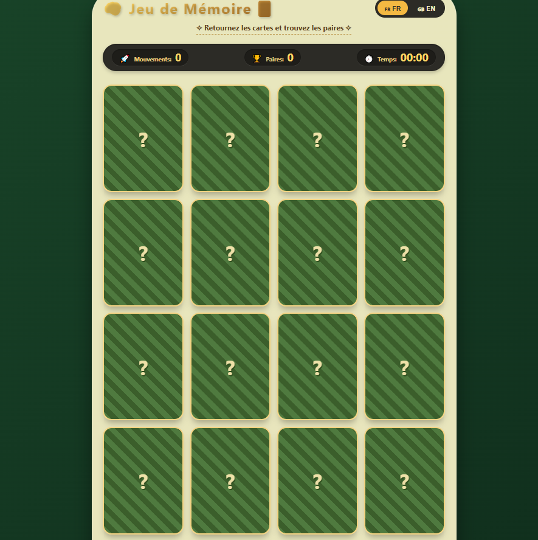
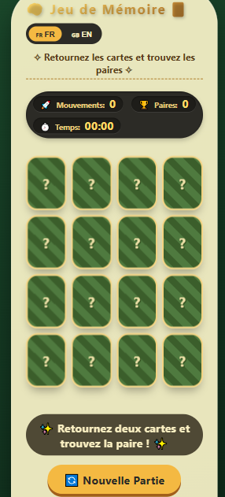

                                     # 🧠 Memory Game - Jeu de Mémoire


[](https://github.com/votre-username/memory-game)
[](https://html.spec.whatwg.org/)
[](https://www.w3.org/Style/CSS/)
[](https://www.javascript.com/)
[](LICENSE)
[](http://makeapullrequest.com)


## 📑 Table des matières
- [🎮 Demo](#-demo)
- [✨ Fonctionnalités](#-fonctionnalités)
- [📸 Aperçu du jeu](#-aperçu-du-jeu)
- [🚀 Installation](#-installation)
- [🎯 Comment jouer ?](#-comment-jouer-)
- [🛠️ Technologies](#️-technologies)
- [🎨 Personnalisation](#-personnalisation)
- [📊 Architecture](#-architecture)
- [🌍 Bilingual](#-bilingual)
- [📈 Performance](#-performance)
- [🤝 Contribution](#-contribution)
- [📝 Licence](#-licence)

---


---


## 📸 Aperçu du jeu

### Interface principale
<p align="center">
  
  <br>
  <em>Interface principale du jeu avec les cartes retournées</em>
</p>


### Version mobile (responsive)
<div align="center">
  <table>
    <tr>
      <td align="center">
        
        <br><em>Vue smartphone</em>
      </td>
    </tr>
  </table>
</div>


---


## 🚀 Installation

```bash
# 1. Clonez le dépôt
git clone https://github.com/votre-username/memory-game.git

# 2. Accédez au dossier
cd memory-game


